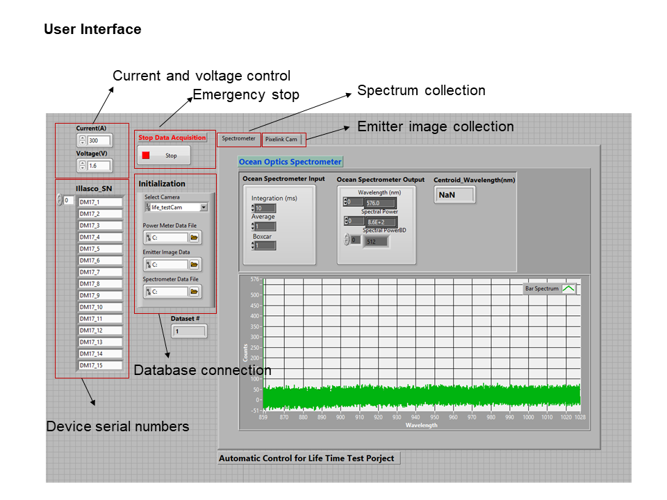

# Auto_Life_Test_Data_Collection_System

## Motivation:

To qualify the diode laser reliability, batch samples are required to be loaded into life tester and ran in an operational state until the output power drops below the certain threshold. The life tester doesn’t have any capability to monitor the device power, spectrum, wavelength, or other attributes. To access this information, devices must be unloaded and transferred regularly to a test lab after a certain time interval. This way, the critical crossing time point when the device power drops to the threshold is easily missed. Additionally, extra contamination can be caused during device handling and transferring.

## Solution:
To solve this issue, I began to build this automatic life test data collection system using LabVIEW, a graphic programming language. The system contains a diagnostic assembly driven by a linear stage, which is capable to record device attributes such as emitting power, wavelength, and spectrum. It can also automatically focus the camera and collect imaging data at the emitting area. The scanning repetition rate can be modified based on the requirement. Data is saved directly into the production SQL database. This software app has an GUI interface to monitor the device power level in time which reveals the time point crossing the threshold. This system saves all the manual labor and time for collecting data and prevents the possible source of contamination. Another cool feature is to use Fourier analysis for dead emitting area analysis. Since the emitting pattern has a periodical structure, using this algorithm, it’s possible to identify micro-structure damage across the active emitting area.
Through this project, I gained a solid foundation in using LabVIEW and a better understanding of LabVIEW data structures, flow control, event structure and parallel processing. Practice of interacting with production database also enhanced and improved my SQL query skills. 

 

## User Interface and Instructions
1. SQL database snapshots:

2. UI:

3. Operation steps: 
    * Step1:

    * Step2: 

    * Step3:

    * Step4: 

    * Step5: 

    * Step6: 

    * Step7: 

 
